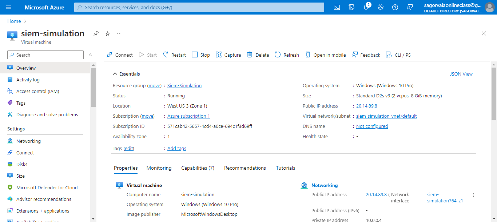
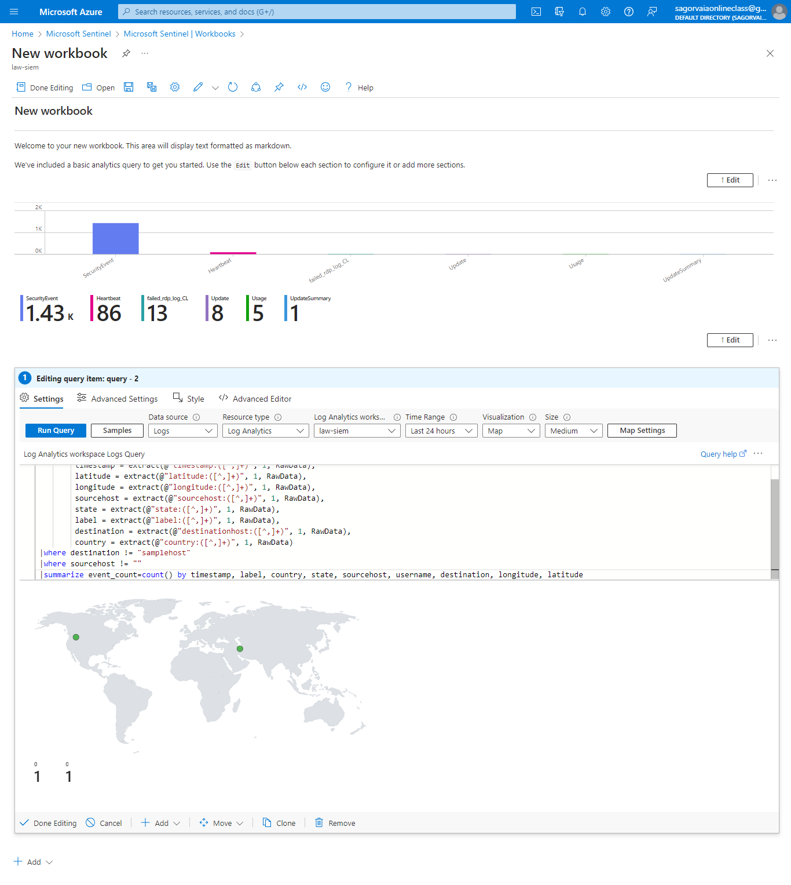

# SIEM-Home-Lab
SIEM Home Lab is a simulated SIEM lab on MS Azure to collect, analyze and visualize custom logs from Windows Virtual Machine.
Technology: Azure, Azure sentinel, Azure Log Analytics Worksoace.
Fist, a Windows virtual machine is created with all firewall turned off, network discovery on.
[] 
Then, the VM is connected to log analytics workspace to get custom logs from powershell script.
Azure sentinel is used for the query and visualization of failed rdp connection attempts.
[]
